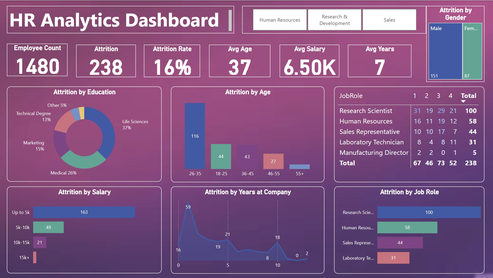

#  HR Analytics Dashboard – Power BI Interactive Report

Built with Power BI and visual storytelling techniques

## 📷 Dashboard Preview

Here is a snapshot of the final report:

 
 📊 Dashboard Overview

This interactive dashboard provides a clear and intuitive visualization of employee attrition across different categories such as salary range, education, job role, age group, and department.

It was designed to help HR teams and decision-makers identify key patterns behind employee turnover and take data-informed actions to improve retention.

The report includes the following insights:

- Total number of employees and attrition count
- Attrition rate across key segments (job role, salary, age, education, etc.)
- Average salary, age, and tenure
- Department-level filters for more granular analysis

 🎯 Project Goals

- Help businesses identify the most affected groups in terms of attrition
- Understand whether salary, education, or experience influence turnover
- Provide a visually engaging and actionable report for HR teams

Data Cleaning & Preparation

All data cleaning was done within Power BI's Power Query Editor using:

- Column renaming and standardization
- Grouping and summarizing metrics
- Creating calculated columns like `Attrition_Count` and `AgeGroup`
- Filtering unnecessary columns
- Ensuring clean relationships between fact and dimension tables

🧩 Data Model

The report uses a star schema for clean data structure:

- Fact Table: `HR_Data` (central dataset with all metrics)
- Dimension Tables:
  - `Departments`
  - `Jobs`
  - `Education`

Each table is connected with a one-to-many relationship using proper keys.

🛠 Tools Used

- Power BI Desktop
- Power Query Editor (for data transformation)
- Power BI visualizations (cards, bar charts, pie charts, filters, etc.)

🚀 How to Use the Report

To explore the dashboard interactively:

1. Clone the repository or download the `.pbix` file
2. Open it with [Power BI Desktop](https://powerbi.microsoft.com/desktop/)
3. Use slicers and filters to interact with different views
4. Optionally modify visuals or connect to your own dataset

## 📁 Dataset

The main dataset `HR_Data.csv` includes the following fields:

- Age, Age Group, Gender
- Department, Job Role, Education
- Salary (DailyRate), Attrition status, Years at company

These columns were used to segment and analyze attrition across the employee population.

👨‍💼 Author
Florian Boulay
MBA Graduate | Data Analyst | Business Intelligence  
📧 florian.boulay@hec.ca 
🔗 [LinkedIn](https://www.linkedin.com/in/florian-boulay-524298179/)

